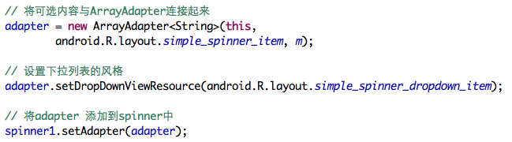
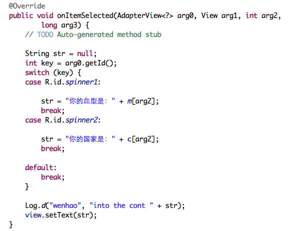

Spinner组件是Android当中非常常用的一种用于下拉选择的组件。

本blog当中主要解决的几个问题：

- 如何在XML中初始化Spinner选项
- 如何使用代码的方式初始化Spinner选项
- 一个Activity当中多个Spinner的监听

<!--more-->

如何在XML中初始化Spinner选项
---

打开`res/values`在其中创建`arrays.xml`文件。添加如下内容：

在对应的Spinner布局文件当中添加如下选项：
`android:entries="@array/country_arrays"`

spinner有两种弹出方式：`dialog`和`dropdown`。如果是`dialog`方式还可以为dialog添加title。方法为：`android:prompt="@string/country_prompt"`(*如果为`dropdown`方式，prompt属性无效*)

如何使用代码的方式初始化Spinner选项
---
在代码中添加首先定义一个数组，存放需要spinner选项中需要显示的数据。`private static final String[] m = { "A型", "B型", "O型", "AB型", "其他" };`

然后进行如下设置：

一个Activity当中多个Spinner的监听
---

如果Activity中只有一个Spinner，监听item选择监听的实现比较简单，但是当有两个Spinner时，我们就需要区分到底是哪个Spinner。代码如下：

> 重点：
> 区分多个spinner通过arg0获取id而不是通过arg1

示例代码
---

[http://git.oschina.net/hnrainll/SpinnerDemo](http://git.oschina.net/hnrainll/SpinnerDemo)

引用
---

- [http://developer.android.com/reference/android/widget/Spinner.html](http://developer.android.com/reference/android/widget/Spinner.html)
- [http://git.oschina.net/hnrainll/SpinnerDemo](http://git.oschina.net/hnrainll/SpinnerDemo)
- [http://www.mkyong.com/android/android-spinner-drop-down-list-example/](http://www.mkyong.com/android/android-spinner-drop-down-list-example/)

> Written with [LeoChin](https://leochin.com/).