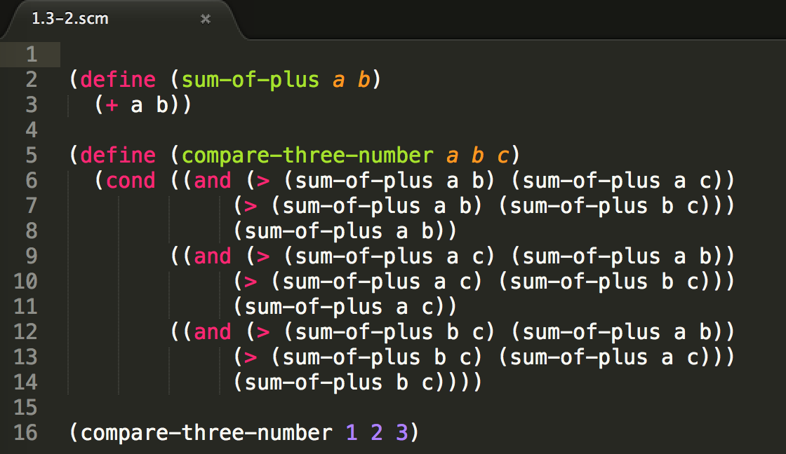
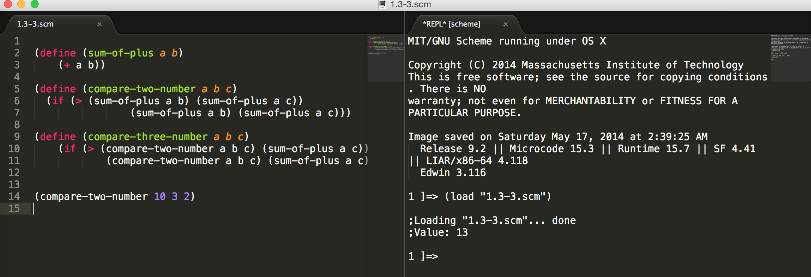

> 以下操作基于Mac OS

##Install MIT-Scheme
在Mac上安装有两种方式：

- 通过brew安装
- 下载MIT-Scheme安装包

因为brew是Mac上非常优秀的包管理工具，常用的软件我也都会使用brew安装。但是因为通过brew 安装MIT-Scheme需要安装很多其他的管理包，所以在尝试用brew安装失败后我还是选择了通过第二种方式安装。

##安装Scheme
[http://www.gnu.org/software/mit-scheme/](http://www.gnu.org/software/mit-scheme/)

选择适合自己的版本，下载并安装Scheme包。

##Scheme配置
Scheme配置引用自：[https://jacksonisaac.wordpress.com/2014/03/25/installing-scheme-on-mac-os-x/](https://jacksonisaac.wordpress.com/2014/03/25/installing-scheme-on-mac-os-x/)

####Step 1
For 32-bit package:
> sudo ln -s /Applications/MIT\:GNU\ Scheme.app/Contents/Resources /usr/local/lib/mit-scheme-i386

For 64-bit package:
> sudo ln -s /Applications/MIT\:GNU\ Scheme.app/Contents/Resources /usr/local/lib/mit-scheme-x86-64

####Step 2
For 32-bit package:
> sudo ln -s /usr/local/lib/mit-scheme-i386/mit-scheme /usr/bin/scheme

For 64-bit package:
> sudo ln -s /usr/local/lib/mit-scheme-x86-64/mit-scheme /usr/bin/scheme

####Step 3
终端运行，就可以使用Scheme编程啦！
> scheme

##Scheme开发环境搭建
Scheme的开发环境大部分，使用vim和Emacs。Emacs使用的很少命令也太多，导致我放弃该环境。最初我选择了vim的环境(呵呵，当然是因为对vim比较熟悉)，但是通过几天的使用，发现其代码调试过于麻烦。导致我在思考选择其他环境。也是今天我介绍的重点:Sublime Text 2

####Sublime Text 2 下载地址
[http://www.sublimetext.com/2](http://www.sublimetext.com/2)

####Sublime Package Control 安装
PackageControl下载地址：[https://packagecontrol.io/installation](https://packagecontrol.io/installation)

 View > Show Console 中输入:

> import urllib2,os,hashlib; h = 'eb2297e1a458f27d836c04bb0cbaf282' + 'd0e7a3098092775ccb37ca9d6b2e4b7d'; pf = 'Package Control.sublime-package'; ipp = sublime.installed_packages_path(); os.makedirs( ipp ) if not os.path.exists(ipp) else None; urllib2.install_opener( urllib2.build_opener( urllib2.ProxyHandler()) ); by = urllib2.urlopen( 'http://packagecontrol.io/' + pf.replace(' ', '%20')).read(); dh = hashlib.sha256(by).hexdigest(); open( os.path.join( ipp, pf), 'wb' ).write(by) if dh == h else None; print('Error validating download (got %s instead of %s), please try manual install' % (dh, h) if dh != h else 'Please restart Sublime Text to finish installation')

启动Package Control的方式：Tools > Command Palette 输入pci

####Scheme相关插件
我们会通过Package Control安装插件：**Scheme**, **SublimeREPL**

- Scheme 用于支持语法高亮
- SublimeREPL 用于执行代码、方便调试

安装成功后我们用Sublime 打开scm文件。默认情况下scm文件Sublime会识别为lisp文件。我们可以通过简单的设置让Sublime识别scm文件为Scheme代码。
> View > Syntax > Open all with current extension as > Scheme

效果图如下：

调试代码我们就需要用到SublimeREPL。

首先我们可以让Sublime左右显示两个Layout。
> View > Layout > Columns:2

然后
> Tools > SublimeREPL > Scheme

如果想运行Scheme代码，我们还需要设置Build系统：
> Tools > Build System > sublimerepl_build_system_hack

然后就在终端中运行Scheme代码了.
