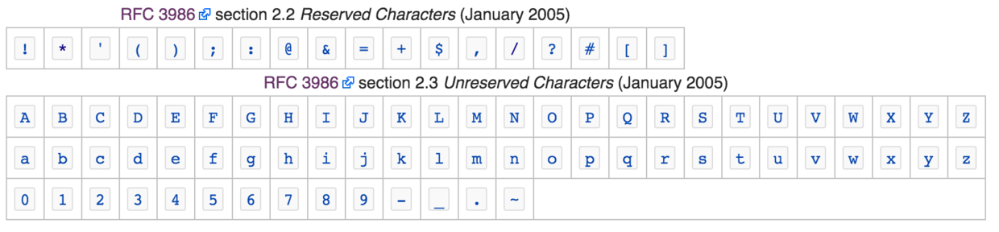

这个问题涉及到URL的定义。我们知道URL是为了统一的命名网络中的一个资源（URL不是单单为了HTTP协议而定义的，而是网络上的所有的协议都可以使用）。

所以这就要求URL有一些基本的特性：

- URL是可移植的。（所有的网络协议都可以使用URL）
- URL的完整性。（不能丢失数据，比如URL中包含二进制数据时，如何处理）
- URL的可阅读性。（希望人能阅读）

因为一些历史的原因URL设计者使用US-ASCII字符集表示URL。（原因比如ASCII比较简单;所有的系统都支持ASCII）

为了满足URL的以上特性，设计者就将转义序列移植了进去，来实现通过ASCII字符集的有限子集对任意字符或数据进行编码。

URL转义表示法包含一个百分号，后面跟上两个表示字符ASCII码的十六进制数值。

现在URL转义表示法比较常用的有两个：

- [RFC 2396 - Uniform Resource Identifiers (URI): Generic Syntax](https://tools.ietf.org/html/rfc2396)
- [RFC 3986 - Uniform Resource Identifier (URI): Generic Syntax](https://tools.ietf.org/html/rfc3986)

以下是RFC3986中对转义部分的一些定义：

Reserved characters are those characters that sometimes have special meaning。
Unreserved characters have no such meanings。

就是说在RFC3986中Unreserved characters部分的字符是不需要转义的其他都需要。

PS：不同的编程语言对于URL的转义还不一样。比如Java中的URLEncoder是按照RFC2398转义，PHP5中的rawurlencode是按照RFC3986转义。

Reference：

- [Percent-encoding - Wikipedia](https://en.wikipedia.org/wiki/Percent-encoding)
- HTTP权威指南 2.4章
